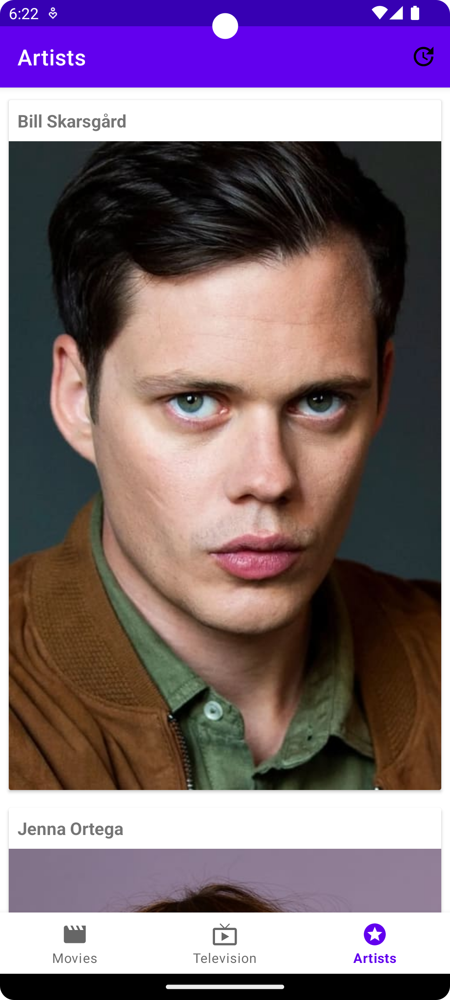

## TMDB

#### Introducing an Android app for tracking movies and TV shows, built with clean architecture, MVVM, Retrofit, Dagger 2, Room, and Glide. Integrates [TMDB API](https://www.themoviedb.org/documentation/api?language=en-CA) to download images and metadata. 

---

`Note:
For the app to work, register on the TMDB Developer API website, get an access key and paste it into the gradle.properties file in the root folder. And you're done! 
`

---

### Libraries Used:
* Navigation
* Dagger 2 (Dependency Injection)
* Retrofit + GSON (Networking) 
* Glide (Image Loading + Caching)
* Room
* Coroutines

---

### Screenshots:
| | | | |
|---|---|---|---|
|  |  |  | 
